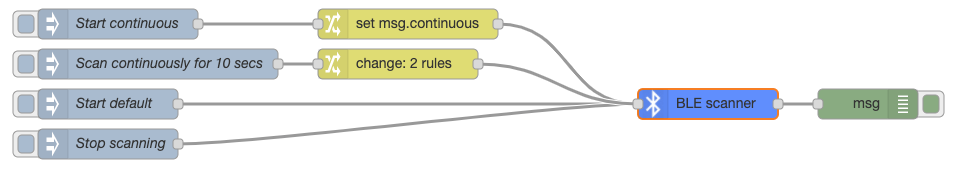
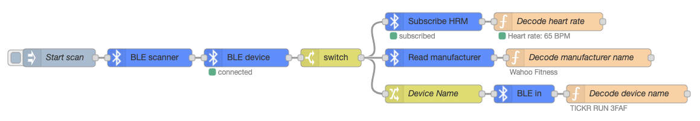

# node-red-contrib-noble-bluetooth

A Node-RED module based on noble for interaction with Bluetooth Low Energy (BLE) devices.

## Installation

```
npm install node-red-contrib-noble-bluetooth
```

## Prerequisite

Requires [@abandonware/noble](https://www.npmjs.com/package/@abandonware/noble) module for bluetooth communication

## Quick Start

Create a **BLE scanner** node and hook its input up to an inject node. Send a message with `topic` "start" to start scanning for devices. By befault it will search for any device. Can be configured to only search for devices publishing certaing services by providing an array of UUID's.

Connect the output to a **BLE device** node to connect to the found device. This will establish a connection to the device and discover all published services and characteristics.

Use a **BLE in** node to read from the device or a **BLE out** note to write to it.

More details about parameters and usage in each node's info panel.

## Examples
The following show some simple examples of how to use the nodes. They are both available from the Import menu in the Node RED editor.

### Scan for Devices
Shows the different ways to scan for devices, including continuous mode or for a limited time.

</img>

### Heart Rate Sensor
Shows how to scan for a standard heart rate sensor and subscribe to the pulse measurements. Also shows how to read data from characteristics.

</img>

## License
Licensed under the MIT License - see the [LICENSE](LICENSE) file for details.

